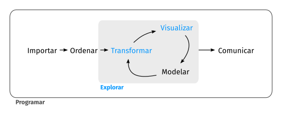

## Trabajo previo

### Lecturas

Antes de la clase, revise las siguientes lecturas. De la primera interesan especialmente las secciones 1.1 y 1.2, sobre los datos, las observaciones, las variables y sus tipos; de la segunda, el modelo del ciclo de vida de la ciencia de datos. Ambas están en inglés; de la segunda existe una traducción al español de su primera edición, cuyo capítulo introductorio cubre esencialmente el mismo contenido y se lista como alternativa.

Çetinkaya-Rundel, M. y Hardin, J. (2024). Hello data. En *Introduction to modern statistics* (2.ª ed.). OpenIntro. <https://openintrostat.github.io/ims/data-hello.html>

Wickham, H., Çetinkaya-Rundel, M. y Grolemund, G. (2023). Introduction. En *R for data science: Import, tidy, transform, visualize, and model data* (2.ª ed.). O'Reilly Media. <https://r4ds.hadley.nz/intro>

Wickham, H. y Grolemund, G. (2023). Introducción. En *R para ciencia de datos* (Comunidad de R de América Latina, trad.; coord. por R. Quiroga). <https://es.r4ds.hadley.nz/01-intro.html> (Obra original publicada en 2017)

## Introducción

Quienes hacen ciencia tratan de responder preguntas mediante métodos rigurosos y observaciones cuidadosas. Estas observaciones, recopiladas de notas de campo, encuestas y experimentos, entre otras fuentes, forman la columna vertebral de una investigación y se denominan datos (Çetinkaya-Rundel y Hardin, 2024). En geografía, esos datos suelen tener un componente espacial: están asociados a lugares mediante coordenadas u otras referencias. Es el caso, por ejemplo, de los registros de presencia de especies, las mediciones climáticas y las imágenes satelitales que se analizarán a lo largo de este curso.

Este capítulo introduce los conceptos fundamentales sobre los datos —observaciones, variables y sus tipos— y presenta la ciencia de datos como la disciplina que permite convertirlos en conocimiento. Además, aborda dos ideas que acompañarán todo el curso: la reproducibilidad de los análisis y las herramientas informáticas que la hacen posible.

## Datos

En términos generales, los **datos** son representaciones simbólicas (numéricas, alfabéticas, visuales o de cualquier otro tipo) susceptibles de ser comunicadas, interpretadas y procesadas para generar información o conocimiento. La norma internacional ISO/IEC 2382 (Information technology — Vocabulary) describe los datos como *hechos relacionados con un objeto o evento, que pueden registrarse o transmitirse con fines de procesamiento* (ISO/IEC 2382, 2015). Por su parte, Beyer y Laney (2012) señalan que los datos son la *materia prima de la información y, en su conjunto, pueden constituir activos de gran valor para organizaciones y sistemas de conocimiento*. Los datos, por sí mismos, no siempre constituyen información, sino que adquieren sentido al ser analizados, contextualizados y combinados.

Por ejemplo, la tabla 1 muestra un conjunto de datos conformado por registros de presencia de especies de fauna silvestre en Costa Rica, obtenidos de [GBIF](https://www.gbif.org/) (Infraestructura Mundial de Información en Biodiversidad). Los nombres de las variables corresponden a términos del estándar [Darwin Core](https://dwc.tdwg.org/), tal como los entrega GBIF.

<figure style="text-align: center; margin: 20px 0;">
    <figcaption><strong>Tabla 1</strong>. Registros de presencia de especies de fauna silvestre en Costa Rica. Fuente: <a href="https://www.gbif.org/">GBIF</a> (consulta: 8 de agosto de 2026).</figcaption>
    <table class="table table-bordered table-striped" style="margin: 0 auto;">
        <thead>
            <tr>
                <th>gbifID</th>
                <th>species</th>
                <th>decimalLongitude</th>
                <th>decimalLatitude</th>
                <th>elevation</th>
                <th>eventDate</th>
                <th>individualCount</th>
                <th>iucnRedListCategory</th>
                <th>basisOfRecord</th>
            </tr>
        </thead>
        <tbody>
        <tr>
            <td><a href="https://www.gbif.org/occurrence/5083205506">5083205506</a></td>
            <td><em>Panthera onca</em></td>
            <td class="align-right">-85.414700</td>
            <td class="align-right">10.819316</td>
            <td class="align-right"></td>
            <td>2024-01-26</td>
            <td class="align-right">3</td>
            <td>NT</td>
            <td>MACHINE_OBSERVATION</td>
        </tr>
        <tr>
            <td><a href="https://www.gbif.org/occurrence/5891408331">5891408331</a></td>
            <td><em>Puma concolor</em></td>
            <td class="align-right">-85.058334</td>
            <td class="align-right">9.873334</td>
            <td class="align-right">362</td>
            <td>2018-04-10</td>
            <td class="align-right">1</td>
            <td>LC</td>
            <td>MATERIAL_CITATION</td>
        </tr>
        <tr>
            <td><a href="https://www.gbif.org/occurrence/4174649301">4174649301</a></td>
            <td><em>Tapirella bairdii</em></td>
            <td class="align-right">-83.500000</td>
            <td class="align-right">9.500000</td>
            <td class="align-right">3654</td>
            <td>1967-02-04</td>
            <td class="align-right">1</td>
            <td></td>
            <td>PRESERVED_SPECIMEN</td>
        </tr>
        <tr>
            <td><a href="https://www.gbif.org/occurrence/4174649340">4174649340</a></td>
            <td><em>Ateles geoffroyi</em></td>
            <td class="align-right">-84.893100</td>
            <td class="align-right">10.437500</td>
            <td class="align-right">905</td>
            <td>1969-11-07</td>
            <td class="align-right">1</td>
            <td>EN</td>
            <td>PRESERVED_SPECIMEN</td>
        </tr>
        <tr>
            <td><a href="https://www.gbif.org/occurrence/6150492462">6150492462</a></td>
            <td><em>Crocodylus acutus</em></td>
            <td class="align-right">-84.617872</td>
            <td class="align-right">9.757316</td>
            <td class="align-right"></td>
            <td>2026-01-13</td>
            <td class="align-right">1</td>
            <td>VU</td>
            <td>HUMAN_OBSERVATION</td>
        </tr>
        <tr>
            <td><a href="https://www.gbif.org/occurrence/5131991086">5131991086</a></td>
            <td><em>Chelonia mydas</em></td>
            <td class="align-right">-83.873328</td>
            <td class="align-right">8.716209</td>
            <td class="align-right"></td>
            <td>2025-04-16</td>
            <td class="align-right">2</td>
            <td>LC</td>
            <td>HUMAN_OBSERVATION</td>
        </tr>
        <tr>
            <td><a href="https://www.gbif.org/occurrence/6150672236">6150672236</a></td>
            <td><em>Ara macao</em></td>
            <td class="align-right">-83.469447</td>
            <td class="align-right">8.873869</td>
            <td class="align-right"></td>
            <td>2026-01-29</td>
            <td class="align-right">8</td>
            <td>LC</td>
            <td>HUMAN_OBSERVATION</td>
        </tr>
        <tr>
            <td><a href="https://www.gbif.org/occurrence/896284939">896284939</a></td>
            <td><em>Ara macao</em></td>
            <td class="align-right">-85.317394</td>
            <td class="align-right">10.810174</td>
            <td class="align-right">853</td>
            <td>1930-10-25</td>
            <td class="align-right"></td>
            <td>LC</td>
            <td>PRESERVED_SPECIMEN</td>
        </tr>
    </tbody>
    </table>
</figure>

Los registros de la tabla 1 corresponden a especies conocidas en Costa Rica como jaguar (*Panthera onca*), puma (*Puma concolor*), danta (*Tapirella bairdii*), mono araña centroamericano (*Ateles geoffroyi*), cocodrilo americano (*Crocodylus acutus*), tortuga verde (*Chelonia mydas*) y lapa roja (*Ara macao*).

Algunos detalles ayudan a leer la tabla. La columna `gbifID` contiene el identificador único que GBIF le asigna a cada registro y enlaza a su página original (`gbifID` e `iucnRedListCategory` son campos agregados por GBIF, no términos del estándar Darwin Core). La altitud (`elevation`) se expresa en metros. Los valores de `iucnRedListCategory` corresponden a las categorías de riesgo de extinción de la [Lista Roja](https://www.iucnredlist.org/es) de la Unión Internacional para la Conservación de la Naturaleza (UICN): LC (preocupación menor), NT (casi amenazada), VU (vulnerable) y EN (en peligro).

El conjunto de datos consta de ocho observaciones (filas) y nueve variables (columnas). Nótese que algunas celdas están vacías: es común que los datos reales contengan **valores faltantes**, algo que debe tenerse en cuenta al procesarlos.

### Observaciones y variables

La presentación y descripción efectivas de los datos constituyen el primer paso en un análisis (Çetinkaya-Rundel y Hardin, 2024). Una de las formas más comunes de representar datos es mediante tablas en las cuales cada fila es una **observación** y cada columna es una **variable**. Una observación corresponde a un elemento de datos que ha sido estudiado y cada variable a una característica de ese elemento. En la tabla 1, por ejemplo, cada observación corresponde a un registro de presencia de una especie, descrito por nueve variables.

### Tipos de variables

Las variables de los datos de la tabla 1 son de varios tipos, cuya jerarquía se muestra en la figura 1.

```{mermaid}
flowchart TD
  V([Variables]) --> N([Numéricas])
  V --> C([Categóricas])
  V --> T([Temporales])
  N --> ND([Discretas])
  N --> NC([Continuas])
  C --> CN([Nominales])
  C --> CO([Ordinales])
  T --> TF([Fechas])
  T --> TH([Horas])
  T --> TFH([Fechas y horas])
  V --> E([Espaciales])
  E --> EV([Vectoriales])
  EV --> EP([Puntos])
  EV --> EL([Líneas])
  EV --> EPO([Polígonos])
  E --> ER([Ráster])
```

<p style="text-align: center;"><strong>Figura 1</strong>. Tipos de variables. Elaboración propia con base en Çetinkaya-Rundel y Hardin (2024), McKinney (2022), Olaya (2020) y Open Geospatial Consortium (2011).</p>

#### Numéricas

Corresponden a números a los cuales se les pueden aplicar operaciones como suma, resta, multiplicación, división y otras similares. Las variables numéricas pueden ser discretas o continuas.

##### Discretas

Toman valores específicos que se pueden contar. Surgen típicamente de conteos, por lo que entre dos valores consecutivos no existen valores intermedios posibles: pueden observarse 2 o 3 individuos, pero no 2.5. La variable `individualCount` (cantidad de individuos observados en cada registro), en este caso, es discreta.

##### Continuas

Pueden tomar cualquier valor dentro de un intervalo o rango continuo. Estas variables se caracterizan por su capacidad para representar medidas precisas y pueden asumir un número infinito de valores, incluso dentro de un rango limitado (ej. entre 0 y 1). Las variables `decimalLongitude` (longitud), `decimalLatitude` (latitud) y `elevation` (altitud) son continuas. Nótese que la altitud aparece redondeada al metro en la tabla 1: esto refleja la precisión con que se midió, no la naturaleza de la variable, ya que entre dos altitudes cualesquiera siempre hay valores intermedios posibles. En cambio, una variable discreta como `individualCount` solo puede tomar ciertos valores, sin intermedios.

#### Categóricas

Las variables categóricas (también llamadas cualitativas) son aquellas que describen una característica o cualidad de una observación y pueden utilizarse para clasificar las observaciones en grupos o categorías. A diferencia de las variables numéricas, que expresan cantidades, las variables categóricas expresan atributos no numéricos. Las variables categóricas pueden ser nominales u ordinales.

##### Nominales

No existe un orden inherente o jerarquía entre las categorías. Las variables `species` (nombre científico) y `basisOfRecord` (tipo de registro) son nominales. También lo es `gbifID`: aunque sus valores son números, funcionan como etiquetas que identifican cada registro, por lo que no tiene sentido aplicarles operaciones aritméticas. Las variables nominales solo admiten comparaciones de igualdad y suelen resumirse mediante conteos y frecuencias (ej. cuántos registros hay de cada especie).

##### Ordinales

Hay un orden o jerarquía clara entre las categorías, como en el caso de la variable `iucnRedListCategory`, cuyas categorías siguen un orden creciente de riesgo de extinción (LC < NT < VU < EN). Sin embargo, ese orden no implica que las distancias entre categorías sean uniformes: no puede afirmarse que la diferencia entre LC y NT sea igual a la diferencia entre VU y EN. Por eso las variables ordinales, a pesar de su orden, no admiten las operaciones aritméticas de las variables numéricas.

#### Temporales

Representan puntos en el tiempo: fechas, horas o combinaciones de ambas (McKinney, 2022). Permiten ordenar cronológicamente las observaciones y calcular duraciones. Aunque suelen registrarse como texto, los lenguajes de programación ofrecen tipos de datos específicos para manejarlas y se recomienda expresarlas en formatos estándar como el de la norma [ISO 8601](https://es.wikipedia.org/wiki/ISO_8601) (ej. `2024-01-26`). La variable `eventDate`, en este caso, es temporal.

#### Espaciales

Representan la ubicación y la forma de los objetos y fenómenos en el espacio geográfico, mediante dos modelos principales (Olaya, 2020). En el modelo **vectorial**, los objetos se representan con geometrías como puntos, líneas y polígonos, según el estándar *Simple Feature Access* (Open Geospatial Consortium, 2011). En el modelo **ráster**, una matriz de celdas representa la variación continua de una variable en el espacio, como la altitud o la temperatura. En la tabla 1 no hay una variable espacial como tal, pero las variables `decimalLongitude` y `decimalLatitude`, que por separado son numéricas continuas, pueden combinarse para construir una vectorial de tipo punto: la ubicación de cada registro de presencia. Esta distinción entre coordenadas y geometrías, así como el modelo ráster, se retomarán al estudiar el procesamiento de datos geoespaciales.

Existen otros tipos, como el texto libre y los valores lógicos (verdadero o falso), que se estudiarán como tipos de datos del lenguaje R.

Esta clasificación no es un fin en sí misma: el tipo de cada variable determina qué operaciones, estadísticas y visualizaciones son válidas (Çetinkaya-Rundel y Hardin, 2024). Por ejemplo, tiene sentido calcular el promedio de `individualCount`, pero no el «promedio» de `basisOfRecord`; una variable ordinal admite mediana pero no media; y una nominal se resume con frecuencias. Al estudiar la visualización de datos se verá, además, que la elección del tipo de gráfico depende de los tipos de las variables representadas.

*Ejercicios de esta sección: [ejercicios sobre datos](#ejercicios-datos).*

## Ciencia de datos

Los datos, en su estado original, carecen de contexto e interpretación. La **ciencia de datos** es una disciplina que permite convertir datos sin procesar en entendimiento, comprensión y conocimiento (Wickham et al., 2023). Combina estadística, matemáticas y programación de computadoras, y se apoya en volúmenes de datos frecuentemente grandes, en técnicas de modelado y en el [aprendizaje automático](https://es.wikipedia.org/wiki/Aprendizaje_autom%C3%A1tico) (*machine learning*).

El surgimiento y la popularidad de la ciencia de datos están motivados por un incremento acelerado de la cantidad de datos existentes, así como por la disponibilidad de herramientas computacionales para procesarlos y analizarlos. Estos avances han sido acompañados por un cambio cultural propiciado por movimientos como el de la [ciencia abierta](https://es.wikipedia.org/wiki/Ciencia_abierta) (*open science*), el cual promueve el acceso libre a la investigación científica, incluidas las publicaciones, los datos, las metodologías y el código fuente, tema que se retoma en la sección de reproducibilidad.

### Procesos

La figura 2 ilustra el ciclo de vida de un proyecto típico de ciencia de datos, el cual incluye los procesos de importar, ordenar, transformar, visualizar, modelar y comunicar. Todos se articulan mediante programación de computadoras.

<figure style="text-align: center;">
  
  <figcaption><strong>Figura 2</strong>. Procesos de ciencia de datos. Fuente: Wickham y Grolemund (2017/2023).</figcaption>
</figure>

**Importar** los datos generalmente implica leerlos de un archivo, una base de datos o una [interfaz de programación de aplicaciones (API)](https://es.wikipedia.org/wiki/API) y cargarlos en estructuras apropiadas para este propósito en un lenguaje de programación.

**Ordenar** o estructurar los datos significa colocarlos en estructuras rectangulares de filas y columnas, similares a tablas, de manera que cada fila sea una observación y cada columna una variable.

**Transformar** los datos incluye, entre otras operaciones, la generación de algún subconjunto de observaciones o variables del conjunto original, la creación de nuevas variables a partir de las ya existentes o el cálculo de estadísticas como conteos y promedios.

Una vez que los datos están bien estructurados y con las variables que se requieren para el análisis, se puede proceder a la generación de conocimiento mediante dos mecanismos: la visualización y el modelado. Ambos tienen fortalezas y debilidades y es común iterar varias veces entre uno y otro.

**Visualizar** los datos en tablas, gráficos, mapas u otros formatos permite encontrar patrones inesperados o formular nuevas preguntas. Una buena visualización también puede indicar si se están formulando preguntas equivocadas o utilizando datos que no son apropiados para el problema que se desea resolver. Es importante tener en cuenta que las visualizaciones deben ser interpretadas por seres humanos. Por este motivo, visualizaciones como gráficos estadísticos y mapas deben ser seleccionadas con cuidado y elaborarse detalladamente.

**Modelar** es crear una representación abstracta y estructurada de los datos, con el fin de facilitar su análisis y realizar predicciones. Al ser herramientas matemáticas o computacionales, los modelos muchas veces pueden mejorarse mediante el empleo de mayores capacidades de cómputo, lo que los hace menos dependientes de la intervención humana que las visualizaciones, las cuales deben ser interpretadas por personas.

**Comunicar** es el último paso y es una actividad crítica de cualquier proyecto de análisis de datos o de ciencia en general. No importa lo bien que los modelos y visualizaciones ayuden a entender los datos si los resultados no pueden ser comunicados a otras personas.

*Ejercicios de esta sección: [ejercicios sobre ciencia de datos](#ejercicios-ciencia-datos).*

## Reproducibilidad

La **reproducibilidad** es la capacidad de un análisis de ser reproducido por otras personas. Más formalmente, en investigación cuantitativa, un análisis se considera reproducible si *el código fuente y los datos utilizados para llegar a un resultado están disponibles y son suficientes para que otra persona, trabajando de manera independiente, pueda llegar al mismo resultado* (Gandrud, 2020). La reproducibilidad se distingue de la **replicabilidad**: un estudio es replicable si una investigación nueva, con datos nuevos, llega a hallazgos consistentes con los del estudio original (National Academies of Sciences, Engineering, and Medicine, 2019).

El concepto de reproducibilidad es cada vez más importante debido, entre otras razones, al aumento acelerado de los datos disponibles y a que especialistas de muchas disciplinas los procesan mediante programación de computadoras. Sin embargo, en años recientes ha crecido la preocupación por la llamada **crisis de reproducibilidad**: en una encuesta de la revista *Nature*, alrededor del 70 % de las personas encuestadas declaró haber intentado reproducir experimentos ajenos sin conseguirlo (Baker, 2016).

Singleton et al. (2016) han identificado los siguientes retos para la reproducibilidad en ciencia de datos geoespaciales:

1. Los datos deben ser de dominio público y estar disponibles para quienes investigan.
2. El software utilizado debe ser de código abierto (*open source*) y estar disponible para ser revisado.
3. Siempre que sea posible, los [flujos de trabajo](https://es.wikipedia.org/wiki/Flujo_de_trabajo) deben ser públicos y con enlaces a los datos, software y métodos de análisis, junto con la documentación necesaria.
4. El proceso de [revisión por pares (*peer review process*)](https://es.wikipedia.org/wiki/Revisi%C3%B3n_por_pares) y la publicación académica deben requerir la presentación de un modelo de flujo de trabajo e idealmente la disponibilidad de los materiales necesarios para la replicación.
5. En los casos en los que la reproducibilidad total no sea posible (ej. datos sensibles), quienes investigan deben esforzarse por incluir todos los aspectos que puedan de un marco de trabajo abierto.

En general, el estándar mínimo de reproducibilidad requiere que los datos y el código fuente estén disponibles para otras personas (Peng, 2011). Sin embargo, dependiendo de las circunstancias y recursos disponibles, existe todo un espectro de posibilidades, como ilustra la figura 3.

<figure style="text-align: center;">
  
  <figcaption><strong>Figura 3</strong>. Espectro de reproducibilidad. Fuente: Graser (2021), con base en Peng (2011).</figcaption>
</figure>

La figura 4 sintetiza el espectro en español: desde la publicación sin materiales, que no es reproducible, hasta la replicación completa, considerada el estándar de oro.

```{mermaid}
flowchart LR
  A["Solo<br>publicación"] --> B["Publicación<br>+ código"] --> C["Publicación<br>+ código y datos"] --> D["Publicación<br>+ código y datos<br>enlazados y ejecutables"] --> E["Replicación<br>completa"]
  style A fill:#f5f5f5,stroke:#999999
  style E fill:#ffe08a,stroke:#b8860b
```

<p style="text-align: center;"><strong>Figura 4</strong>. Síntesis del espectro de reproducibilidad. Elaboración propia con base en Peng (2011).</p>

Este curso practica la reproducibilidad con sus propias herramientas: los materiales se desarrollan en repositorios públicos de GitHub, las lecciones incluyen documentos computacionales ejecutables y el ambiente de programación con el que se generan está documentado en un contenedor (archivo `Dockerfile` del repositorio del curso).

*Ejercicios de esta sección: [ejercicios sobre reproducibilidad](#ejercicios-reproducibilidad).*

## Herramientas

La implementación de un proyecto de ciencia de datos requiere del uso de herramientas informáticas como lenguajes de programación, gestores de paquetes y ambientes, documentos computacionales, sintaxis y formatos para documentación y sistemas de control de versiones.

### Lenguajes de programación

Como se ha mencionado, la programación de computadoras es una actividad presente durante todos los procesos de ciencia de datos. Hay muchos lenguajes que pueden utilizarse en este campo. Entre los más populares, pueden mencionarse [R](https://www.r-project.org/), [Python](https://www.python.org/), [SQL](https://www.iso.org/standard/76583.html) y [JavaScript](https://ecma-international.org/publications-and-standards/standards/ecma-262/). En este curso se utiliza R, un lenguaje diseñado desde su origen para el análisis de datos y la estadística, con un ecosistema maduro de paquetes para ciencia de datos y para datos geoespaciales. Python es también muy utilizado en ciencia de datos; los conceptos de este curso trascienden el lenguaje de programación empleado.

### Gestores de paquetes y ambientes

Los proyectos de ciencia de datos dependen de paquetes que evolucionan con el tiempo. En R, los paquetes se distribuyen principalmente mediante [CRAN](https://cran.r-project.org/) (Comprehensive R Archive Network) y se instalan con la función `install.packages()`. Para que un análisis sea reproducible es necesario documentar qué paquetes usa y en qué versiones: herramientas como [renv](https://rstudio.github.io/renv/) permiten fijar las versiones de los paquetes de un proyecto y recrearlas en otras computadoras. Un paso más allá están los **contenedores**, como los de [Docker](https://www.docker.com/), que empaquetan no solo los paquetes sino también el sistema operativo y demás componentes necesarios para ejecutar un programa en cualquier computadora; el ambiente con el que se genera este sitio web, por ejemplo, está documentado en el archivo `Dockerfile` del repositorio del curso, basado en las imágenes del proyecto [Rocker](https://rocker-project.org/).

### Documentos computacionales

Los **documentos computacionales** combinan en un solo documento código ejecutable, texto en [Markdown](https://es.wikipedia.org/wiki/Markdown) y resultados como tablas, gráficos y mapas. Esa combinación los convierte en una herramienta idónea para la ciencia de datos reproducible y para la comunicación de resultados. Son ejemplos los cuadernos de notas (*notebooks*) de [Jupyter](https://jupyter.org/) y, en el ecosistema de R, los documentos de [Quarto](https://quarto.org/), el sistema de publicación que se estudiará y utilizará a lo largo de este curso. Pueden ejecutarse localmente o en servicios en la nube como [Posit Cloud](https://posit.cloud/); el documento de ejemplo de este capítulo ilustra ambas posibilidades: puede leerse en el sitio web del curso o abrirse y ejecutarse en Posit Cloud.

### Sintaxis y formatos para documentación

La documentación es vital durante todo el ciclo de vida de una investigación reproducible. Se recomienda utilizar mecanismos estandarizados y abiertos como Markdown o el [lenguaje de marcado de hipertexto (HTML, en inglés, *HyperText Markup Language*)](https://es.wikipedia.org/wiki/HTML), con los cuales pueden crearse documentos mediante editores de texto simples (es decir, no se requiere software propietario), exportables a varios formatos (ej. [LaTeX](https://es.wikipedia.org/wiki/LaTeX), [PDF](https://es.wikipedia.org/wiki/PDF)). En este curso, Markdown se usa en el texto de los documentos computacionales de Quarto y en la documentación de los repositorios; este mismo sitio web está escrito en Markdown.

### Sistemas de control de versiones

Para dar mantenimiento, tanto al código fuente como a la documentación, es necesario un sistema de [control de versiones](https://es.wikipedia.org/wiki/Control_de_versiones) como [Git](https://es.wikipedia.org/wiki/Git), el cual permite llevar el registro de los cambios en archivos y también facilita el trabajo colaborativo al reunir las modificaciones hechas por varias personas. Git es usado en varias plataformas que comparten código fuente (ej. [GitHub](https://github.com/), [GitLab](https://about.gitlab.com/)) y que ofrecen servicios relacionados, como el hospedaje de sitios web mediante [GitHub Pages](https://pages.github.com/). En este curso, Git y GitHub se utilizan para desarrollar y publicar los materiales —incluido este sitio web— y el estudiantado los empleará en las tareas y en el proyecto.

*Ejercicios de esta sección: [ejercicios sobre herramientas](#ejercicios-herramientas).*

## Resumen

- Los **datos** son representaciones simbólicas que adquieren sentido al ser analizados, contextualizados y combinados. En geografía suelen tener un componente espacial.
- Una forma común de representar datos son las tablas, en las que cada fila es una **observación** y cada columna una **variable**.
- Las variables se clasifican en **numéricas** (discretas y continuas), **categóricas** (nominales y ordinales), **temporales** y **espaciales** (vectoriales —puntos, líneas y polígonos— y ráster). El tipo de cada variable determina qué operaciones, estadísticas y gráficos son válidos.
- La **ciencia de datos** convierte datos sin procesar en entendimiento, comprensión y conocimiento, mediante los procesos de importar, ordenar, transformar, visualizar, modelar y comunicar, articulados por la programación de computadoras.
- Un análisis es **reproducible** si sus datos y su código permiten a otra persona llegar al mismo resultado; se distingue de la **replicabilidad** (un estudio nuevo con hallazgos consistentes). Entre ambos extremos hay un espectro de posibilidades.
- Las herramientas que hacen posible lo anterior —y que se usarán en el curso— incluyen el lenguaje **R** y sus paquetes de **CRAN**, los documentos computacionales de **Quarto**, los servicios en la nube como **Posit Cloud**, la sintaxis **Markdown** y el control de versiones con **Git** y **GitHub**.

## Ejercicios

Los ejercicios se agrupan según la sección del capítulo a la que corresponden; se recomienda realizarlos al concluir la sección respectiva.

### Datos {#ejercicios-datos}

1. En el portal de [GBIF](https://www.gbif.org/occurrence/search) busque registros de presencia de una especie de su interés (puede filtrar por país u otros criterios). Elija un registro y examine su página de detalle.
    - Identifique al menos cinco variables presentes en el registro y clasifique cada una según la jerarquía de la figura 1.
    - ¿Cuáles variables del registro tienen valores faltantes?
2. [Kaggle](https://www.kaggle.com/datasets) es una plataforma que reúne miles de conjuntos de datos abiertos y que se utilizará más adelante en el curso. Explore el conjunto de datos [Significant Earthquakes, 1965-2016](https://www.kaggle.com/datasets/usgs/earthquake-database), del [Servicio Geológico de los Estados Unidos (USGS)](https://www.usgs.gov/), el cual contiene registros de los sismos más significativos de ese período. A partir de la descripción del conjunto y de la vista previa de los datos:
    - Determine cuántas observaciones y cuántas variables tiene el conjunto y qué representa cada observación.
    - Clasifique las variables principales (fecha, hora, latitud, longitud, profundidad, magnitud y tipo de evento) según la jerarquía de la figura 1.
    - ¿Hay tipos de la jerarquía que no estén representados en el conjunto de datos? Para cada tipo ausente, proponga una variable de ese tipo que podría agregarse al conjunto.
    - Como ejercicio adicional, repita el análisis con otro conjunto de datos de Kaggle de su interés.

### Ciencia de datos {#ejercicios-ciencia-datos}

3. Cuatro de los procesos descritos en la sección (importar, ordenar, transformar y visualizar) se implementan, con datos de biodiversidad, en el documento computacional [Ejemplo de procesos de ciencia de datos](02-ejemplo-procesos-ciencia-datos.qmd). Ábralo, observe cómo se implementa cada proceso y realice los ejercicios que contiene; el primero explica cómo ejecutarlo en Posit Cloud.

### Reproducibilidad {#ejercicios-reproducibilidad}

4. Considere un trabajo de análisis de datos que haya realizado en otro curso o contexto (ej. una tarea, un informe, una investigación). ¿En qué punto del espectro de reproducibilidad (figuras 3 y 4) se ubica? ¿Qué se necesitaría para acercarlo a la reproducibilidad completa?

### Herramientas {#ejercicios-herramientas}

5. Este curso se desarrolla en un repositorio público de GitHub: [github.com/pf0953-programacionr/2026-ii](https://github.com/pf0953-programacionr/2026-ii). Explórelo e identifique:
    - El archivo `Dockerfile` y tres de los paquetes de R que instala.
    - En el historial de confirmaciones (*commits*) del repositorio, un cambio reciente: qué archivo modificó y qué describe su mensaje.
    - El archivo en el que está escrito este capítulo (en el directorio `contenidos/`) y una diferencia entre cómo se ve el archivo fuente y cómo se ve esta página del sitio web.

## Referencias bibliográficas

Baker, M. (2016). 1,500 scientists lift the lid on reproducibility. *Nature*, 533(7604), 452–454. <https://www.nature.com/articles/533452a>

Beyer, M. A. y Laney, D. (2012). *The importance of 'big data': A definition*. Gartner.

Çetinkaya-Rundel, M. y Hardin, J. (2024). Hello data. En *Introduction to modern statistics* (2.ª ed.). OpenIntro. <https://openintrostat.github.io/ims/data-hello.html>

Gandrud, C. (2020). *Reproducible research with R and RStudio* (3.ª ed.). CRC Press.

Graser, A. (2021). *Open source for open spatial data science* [Video]. YouTube. <https://www.youtube.com/watch?v=ZjXb53pOor0>

ISO/IEC 2382. (2015). *Information technology — Vocabulary*. International Organization for Standardization.

McKinney, W. (2022). *Python for data analysis: Data wrangling with pandas, NumPy, and Jupyter* (3.ª ed.). O'Reilly Media. <https://wesmckinney.com/book/>

National Academies of Sciences, Engineering, and Medicine. (2019). *Reproducibility and replicability in science*. The National Academies Press. <https://nap.nationalacademies.org/catalog/25303/reproducibility-and-replicability-in-science>

Olaya, V. (2020). *Sistemas de información geográfica* (versión 3.0). <https://volaya.github.io/libro-sig/>

Open Geospatial Consortium. (2011). *OpenGIS implementation standard for geographic information - Simple feature access - Part 1: Common architecture* (OGC 06-103r4). <https://www.ogc.org/standard/sfa/>

Peng, R. D. (2011). Reproducible research in computational science. *Science*, 334(6060), 1226–1227. <https://www.science.org/doi/10.1126/science.1213847>

Singleton, A. D., Spielman, S. y Brunsdon, C. (2016). Establishing a framework for Open Geographic Information science. *International Journal of Geographical Information Science*, 30(8), 1507–1521. <https://www.tandfonline.com/doi/full/10.1080/13658816.2015.1137579>

Wickham, H., Çetinkaya-Rundel, M. y Grolemund, G. (2023). Introduction. En *R for data science: Import, tidy, transform, visualize, and model data* (2.ª ed.). O'Reilly Media. <https://r4ds.hadley.nz/intro>

Wickham, H. y Grolemund, G. (2023). *R para ciencia de datos* (Comunidad de R de América Latina, trad.; coord. por R. Quiroga). <https://es.r4ds.hadley.nz/> (Obra original publicada en 2017)
