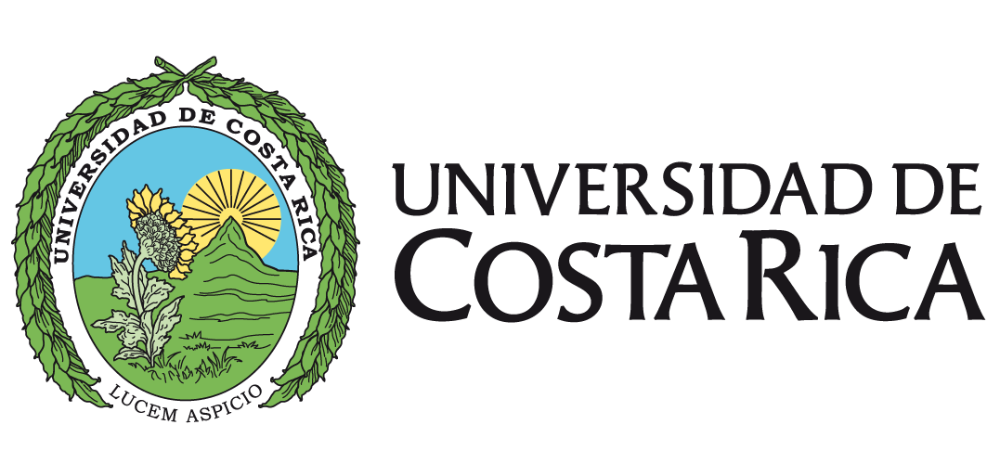

::: {.logos-institucionales}
{fig-alt="Universidad de Costa Rica" height="120px"}
{fig-alt="Sistema de Estudios de Posgrado" height="64px"}
:::

Este curso es una introducción a la programación de computadoras y al procesamiento de datos geoespaciales mediante el lenguaje de programación R. Se estudian los fundamentos del lenguaje, sus paquetes para ciencia de datos y para datos geoespaciales, y las herramientas que facilitan la reproducibilidad de los procedimientos y la comunicación de las soluciones a través de Internet, tanto en documentos computacionales como en aplicaciones interactivas. Además, se incorpora de manera paulatina y crítica el uso de herramientas de inteligencia artificial (IA) como apoyo en los procesos de programación y de análisis de datos.

El curso se imparte en el [Programa de Posgrado en Geografía](https://www.sep.ucr.ac.cr/) del Sistema de Estudios de Posgrado (SEP) de la [Universidad de Costa Rica](https://www.ucr.ac.cr/), así como en la Maestría Académica en Gestión Integrada del Recurso Hídrico para Latinoamérica y el Caribe, durante el II ciclo lectivo de 2026, para el grupo 001, con horario de jueves de 17:00 a 19:50. El horario de atención al estudiantado es los jueves de 14:00 a 16:50.

El curso es completamente virtual: las lecciones se imparten de manera sincrónica por videoconferencia, en el horario del curso. Los contenidos y los recursos relacionados se comparten en este sitio web, así como en la plataforma [Mediación Virtual](https://mv.mediacionvirtual.ucr.ac.cr/course/view.php?id=16311) de la Universidad de Costa Rica, en la que también se publican los enlaces a las sesiones por videoconferencia.

El [programa del curso](programa/programa.md) detalla los objetivos, los contenidos, la metodología, la evaluación y la bibliografía; también está disponible su [versión oficial en PDF](https://github.com/pf0953-programacionr/2026-ii/blob/main/programa/pf0953-programacionr-g001-2026-ii.pdf).

Si tiene alguna pregunta o comentario sobre este curso, por favor contacte a:

> Manuel Vargas - <manuel.vargas_d@ucr.ac.cr>\
> Profesor\
> Universidad de Costa Rica,\
> Ciudad Universitaria Rodrigo Facio,\
> San Pedro de Montes de Oca,\
> Costa Rica.
